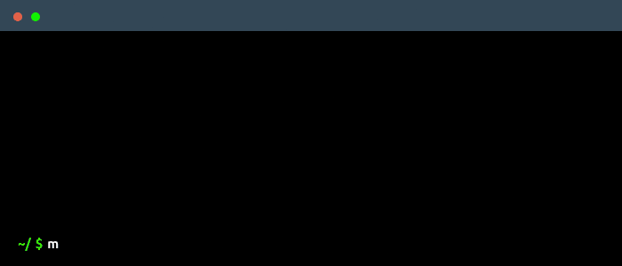

  

---

 <a href="https://github.com/nico-tome/nico-tome">moi</a> | <a href="/translation/en/en.md">en</a> | <a href="/translation/es/es.md">es</a> 

### 🚀 Mes projets

- 🤖 **Machine Learning**

    * [Jeu du pendu](translation/fr/hang-game-ai.md)
    * [Geometry Dash](translation/fr/geometry-dash-ai.md)

- 🎲 **Jeux**

  * [Blue Red Square](translation/fr/blue-red-square.md)
  * [Fisc Adventure](translation/fr/fisc-adventure.md)

- 🛠 **Outils de productivité**

    * [Gouvernail Project Manager](translation/fr/gouvernail-project-manager.md)

- 🔢 **Maths**

    * [Jeu de la vie](translation/fr/game-of-life.md)

- 📌 **Autres**

    * [Morse Translator](translation/fr/morse-translator.md)

- 🔗 **Contribution**
     * [TurboWarp](https://github.com/TurboWarp/extensions) ([pull-request](https://github.com/TurboWarp/extensions/pull/632))
     * [Godot](https://github.com/godotengine/godot) ([pull-requests](https://github.com/godotengine/godot/pulls/nico-tome))

---

    
    
    

---
